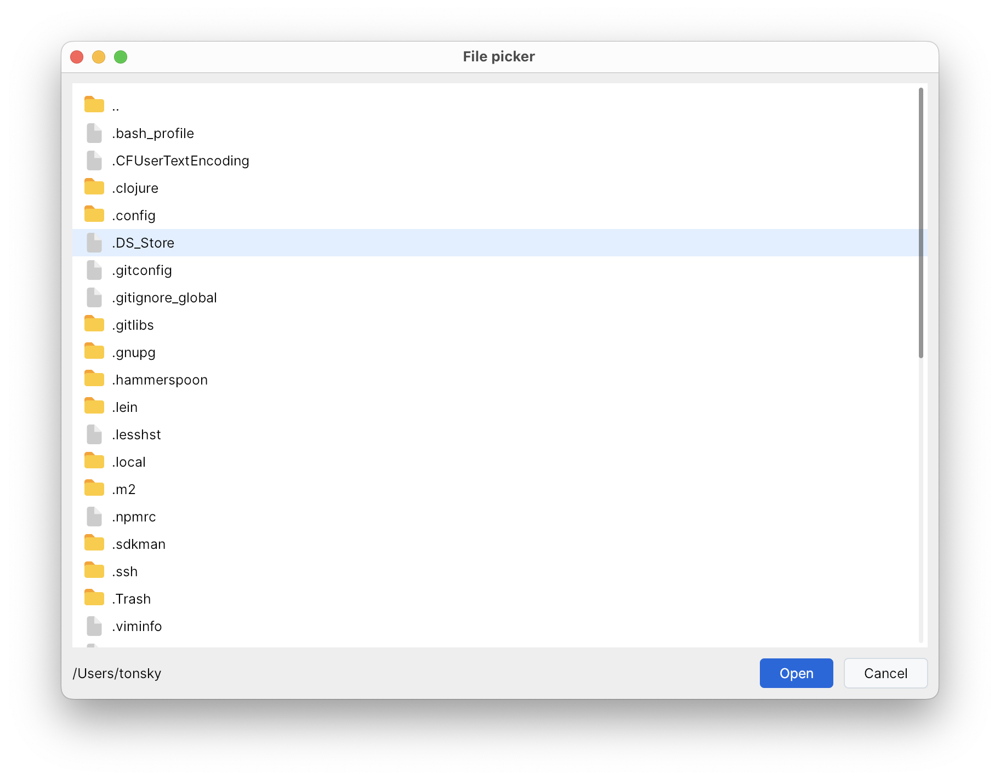

# Demo project for [Humble UI](https://github.com/HumbleUI/HumbleUI)



Start by running

```
clj -M:dev
```

Eval `(file-picker/-main)` to open main window.

Replace `src/file_picker/core.clj` with any file from `step-by-step/` to see incremental progress.

Eval `(io.github.humbleui.docs/open!)` to view Humble UI docs.
